<div align="center">
  
  <h2 align="center">GitHub Profile Trophy</h2>
  <p align="center">🏆 Add dynamically generated GitHub Stat Trophies on your README</p>
</div>
<div align="center">

[](https://github.com/rstar327/github-profile-trophy/stargazers) [](https://github.com/rstar327/github-profile-trophy/network/members) [](https://github.com/rstar327/github-profile-trophy/issues) [](https://github.com/rstar327/github-profile-trophy/blob/master/LICENSE) [](https://twitter.com/intent/tweet?text=Add%20dynamically%20generated%20GitHub%20Trophy%20on%20your%20readme%0D%0A&url=https%3A%2F%2Fgithub.com%2Frstar327%2Fgithub-profile-trophy)

</div>
<p align="center">
  You can use this service for free. I'm looking for sponsors to help us keep up with this service❤️
</p>
<div align="center">
  <a href="https://github.com/sponsors/rstar327">
    
  </a>
</div>

# Quick Start

Add the following code to your readme. When pasting the code into your profile's
readme, change the `?username=` value to your GitHub's username.

```
[](https://github.com/rstar327/github-profile-trophy)
```

[](https://github.com/rstar327/github-profile-trophy)

## Use theme

Add optional parameter of the theme.

```
[](https://github.com/rstar327/github-profile-trophy)
```

[](https://github.com/rstar327/github-profile-trophy)

**[More detail](#apply-theme)**

# About Rank

Ranks are `SSS` `SS` `S` `AAA` `AA` `A` `B` `C` `UNKNOWN` `SECRET`.

| Rank       | Description                                                                                |
| ---------- | ------------------------------------------------------------------------------------------ |
| SSS, SS, S | You are at a hard to reach rank. You can brag.                                             |
| AAA, AA, A | You will reach this rank if you do your best. Let's aim here first.                        |
| B, C       | You are currently making good progress. Let's aim a bit higher.                            |
| UNKNOWN    | You have not taken action yet. Let's act first.                                            |
| SECRET     | This rank is very rare. The trophy will not be displayed until certain conditions are met. |

**NOTE: The `UNKNOWN` rank is denoted by `?`**

## Secret Rank

The acquisition condition is secret, but you can see this.

<p align="center">
  
</p>

There are only a few secret trophies. Therefore, if you come up with interesting
conditions, I will consider adding a trophy. I am waiting for contributions.

# About Display details

<p align="center">
  
</p>

1. Title name of aggregation target.
2. Current rank.
3. Title according to rank.
4. Target aggregation result.
5. Rank progress bar.

# Optional Request Parameters

- [title](#filter-by-titles)
- [rank](#filter-by-ranks)
- [column](#specify-the-maximum-row--column-size)
- [row](#specify-the-maximum-row--column-size)
- [theme](#apply-theme)
- [margin-w](#margin-width)
- [margin-h](#margin-height)
- [no-bg](#transparent-background)
- [no-frame](#hide-frames)

## Filter by titles

You can filter the display by specifying the titles of trophy.

```
https://github-profile-trophy-rstar327.vercel.app/?username=rstar327&title=Followers
```

[](https://github.com/rstar327/github-profile-trophy)

If you want to specify multiple titles.

```
https://github-profile-trophy-rstar327.vercel.app/?username=rstar327&title=Stars,Followers
```

[](https://github.com/rstar327/github-profile-trophy)

You can also exclude the trophies you don't want to display.

```
https://github-profile-trophy-rstar327.vercel.app/?username=rstar327&title=-Stars,-Followers
```

## Filter by ranks

You can filter the display by specifying the ranks.\
`Available values: SECRET SSS SS S AAA AA A B C`

```
https://github-profile-trophy-rstar327.vercel.app/?username=rstar327&rank=S
```

[](https://github.com/rstar327/github-profile-trophy)

If you want to specify multiple ranks.

```
https://github-profile-trophy-rstar327.vercel.app/?username=rstar327&rank=S,AAA
```

[](https://github.com/rstar327/github-profile-trophy)

You can also exclude ranks.

```
https://github-profile-trophy-rstar327.vercel.app/?username=rstar327&rank=-C,-B
```

**NOTE: Since `UNKNOWN` is denoted by `?`, in order to include or exclude it you
will have to use `rank=?` and `rank=-?` respectively**

## Specify the maximum row & column size

You can specify the maximum row and column size.\
Trophy will be hidden if it exceeds the range of both row and column.

`Available value: number type`\
`Default: column=6 row=3`

Restrict only row

```
https://github-profile-trophy-rstar327.vercel.app/?username=rstar327&row=2
```

Restrict only column

```
https://github-profile-trophy-rstar327.vercel.app/?username=rstar327&column=2
```

Restrict row & column

```
https://github-profile-trophy-rstar327.vercel.app/?username=rstar327&row=2&column=3
```

[](https://github.com/rstar327/github-profile-trophy)

Adaptive column

```
https://github-profile-trophy-rstar327.vercel.app/?username=rstar327&column=-1
```

You can set `column` to `-1` to adapt the width to the number of trophies, the
parameter `row` will be ignored.

## Apply theme

Available themes.

| theme                       |
| --------------------------- |
| [flat](#flat)               |
| [onedark](#onedark)         |
| [gruvbox](#gruvbox)         |
| [dracula](#dracula)         |
| [monokai](#monokai)         |
| [chalk](#chalk)             |
| [nord](#nord)               |
| [alduin](#alduin)           |
| [darkhub](#darkhub)         |
| [juicyfresh](#juicyfresh)   |
| [buddhism](#buddhism)       |
| [oldie](#oldie)             |
| [radical](#radical)         |
| [onestar](#onestar)         |
| [discord](#discord)         |
| [algolia](#algolia)         |
| [gitdimmed](#gitdimmed)     |
| [tokyonight](#tokyonight)   |
| [matrix](#matrix)           |
| [apprentice](#apprentice)   |
| [dark_dimmed](#dark_dimmed) |
| [dark_lover](#dark_lover)   |
| [kimbie_dark](#kimbie_dark) |
| [aura](#aura)               |

### flat

[](https://github.com/rstar327/github-profile-trophy)

### onedark

[](https://github.com/rstar327/github-profile-trophy)

### gruvbox

[](https://github.com/rstar327/github-profile-trophy)

### dracula

[](https://github.com/rstar327/github-profile-trophy)

### monokai

[](https://github.com/rstar327/github-profile-trophy)

### chalk

[](https://github.com/rstar327/github-profile-trophy)

### nord

[](https://github.com/rstar327/github-profile-trophy)

### alduin

[](https://github.com/rstar327/github-profile-trophy)

### darkhub

[](https://github.com/rstar327/github-profile-trophy)

### juicyfresh

[](https://github.com/rstar327/github-profile-trophy)

### buddhism

[](https://github.com/rstar327/github-profile-trophy)

### oldie

[](https://github.com/rstar327/github-profile-trophy)

### radical

[](https://github.com/rstar327/github-profile-trophy)

### onestar

[](https://github.com/rstar327/github-profile-trophy)

### discord

[](https://github.com/rstar327/github-profile-trophy)

### algolia

[](https://github.com/rstar327/github-profile-trophy)

### gitdimmed

[](https://github.com/rstar327/github-profile-trophy)

### tokyonight

[](https://github.com/rstar327/github-profile-trophy)

### matrix

[](https://github.com/rstar327/github-profile-trophy)

### apprentice

[](https://github.com/rstar327/github-profile-trophy)

### dark_dimmed

[](https://github.com/rstar327/github-profile-trophy)

### dark_lover

[](https://github.com/rstar327/github-profile-trophy)

### kimbie_dark

[](https://github.com/rstar327/github-profile-trophy)

### aura

[](https://github.com/rstar327/github-profile-trophy)

## Margin Width

You can put a margin in the width between trophies.\
`Available value: number type`\
`Default: margin-w=0`

[](https://github.com/rstar327/github-profile-trophy)

## Margin Height

You can put a margin in the height between trophies.\
`Available value: number type`\
`Default: margin-h=0`

[](https://github.com/rstar327/github-profile-trophy)

## Example layout

[](https://github.com/rstar327/github-profile-trophy)

## Transparent background

You can turn the background transparent.\
`Available value: boolean type (true or false)`\
`Default: no-bg=false`

[](https://github.com/rstar327/github-profile-trophy)

## Hide frames

You can hide the frames around the trophies.\
`Available value: boolean type (true or false)`\
`Default: no-frame=false`

[](https://github.com/rstar327/github-profile-trophy)

## Generate an svg file localy

Using the render_svg.ts script you can generate your trophys as an svg file
given your username, (Enviroment Vars: See [env-example](env-example)).

Usage:

```bash
deno run --allow-net --allow-env --allow-read --allow-write ./render_svg.ts USERNAME OUTPUT_DIR THEME
```

## Generate an svg inside Github CI (Workflow)

Using the provided github action you can easly generate the trophy inside an
github workflow. This eliminates the needs of an online service running but you
have to manualy update rerun the action to update the file.

Usage:

```yaml
- name: Generate trophy
  uses: Erik-Donath/github-profile-trophy@feature/generate-svg
  with:
    username: your-username
    output_path: trophy.svg
    token: ${{ secrets.GITHUB_TOKEN }}
```

# Contribution Guide

Check [CONTRIBUTING.md](./CONTRIBUTING.md) for more details.

# License

This product is licensed under the
[MIT License](https://github.com/rstar327/github-profile-trophy/blob/master/LICENSE).

